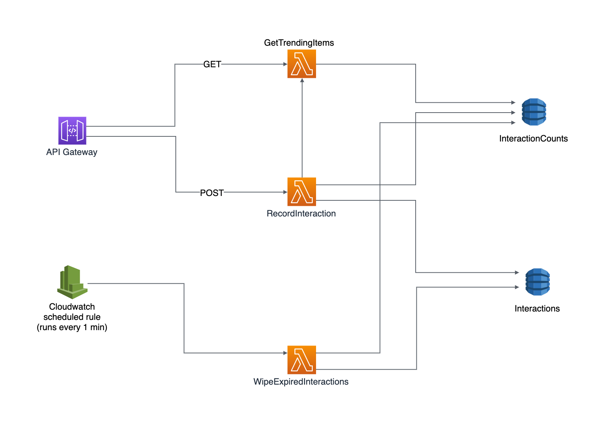

# trend-tracker

## What is it?

This is a RESTful service for tracking lists of trending items.

When a user performs an interaction that you want to track, you POST the id of the item that they've interacted with along with the id of the trending list you want to add it to:

eg on an image sharing platform you might want to track the most 'liked' images

```
POST /?trendListId=likedImages
Host: example.com
Content-Type: application/json
Content-Length: 24

{
  "itemId": "boring_sunset"
}
```

Then when you're ready to consume that list you sent a GET request with the list id:

```
GET /?trendListId=likedImages
Host: example.com
```

This returns a mapping of the top item IDs to interaction counts:

```
{
  "cat1": 12345,
  "cat2": 1234,
  "cat3": 123,
  "cat4": 12,
  "boring_sunset": 1
}
```

You can specify the number of top items items that you'd like to return, and the period over which you'd like to aggregate the results (eg over the last hour or over the last week) - see `configs` in lambda functions

It also supports multiple lists so you could track the most commented images as well as the the most liked images

## Service design


